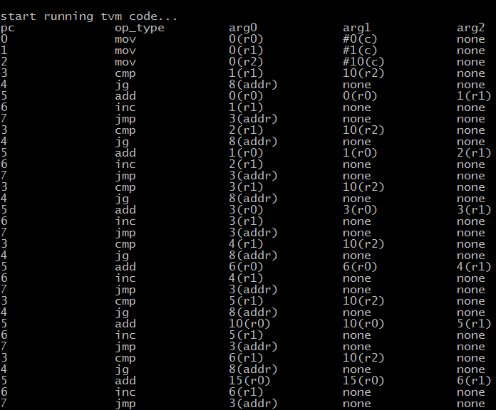

## TVM (Tiny Vitrual Machine)
A tiny virual machine as RISC like assembly interpreter, 
as the middle code reprentation of my further DIY language, 
undergoing...

## TVM Introduction
TVM is a RISC(more register, limited memory access way) like assembly language 
virtual machine or interpreter, it supports arithmetic operation, 
compare operation, jump operation, stack operation as well
as limited memory access operation like ARM Assembly. Explained below in details:

- [x] st, ld: load or store register value to memory, eg st r0, [r1]; ld r0, [r1, r2])
- [x] mov: mov register value or instant value to register, eg mov r0, r1(r0 = r1); mov r0, 1(r0 = 1)
- [x] add, sub, mul, dvi: arithmetic operation, all the parameters should be register, eg add r0, r1, r2(r0=r1+r2)
- [ ] push pop: stack operation 
- [x] inc, dec: unary resgister operation, eg inc r0(r0=r0+1)
- [x] in, out: input ouput operation, just for fun
- [x] cmp: comparision between registers eg cmp r0, r1
- [x] jmp ,je(=), jne(!=), jg(>), jge(>=), jl(<), jle(<=): support multiple condition of comparison 

## TVM Example(example/sum.tvm)
sum.tvm sums 1 to N and print the result
### Code
```asm
    mov r0, 0 
    mov r1, 1
    mov r2, 10 #(N=10)
l1: cmp r1, r2
    jg l2
    add r0, r0, r1
    inc r1
    jmp l1
l2: out r0
    hlt
```
### Symbol Table

### Trace Info 

### Result


## TVM Grammer BNF 
```bnf
reg -> r[0-7]
number -> [0-9]+
mem -> [reg,reg] 
label -> [a-z][a-z0-9]+
mov_expr -> mov reg, (reg | number)
mem_expr -> (st | ld) reg, (mem)  
calc_expr -> add reg, reg, reg |
             sub reg, reg, reg |
             mul reg, reg, reg |
             dvi reg, reg, reg |
cmp_expr -> cmp reg, reg 
stack_expr -> push reg |
              pop reg
one_expr -> inc reg |
            dec reg 
io_expr -> in reg | 
           out reg
jmp_expr -> jmp label | 
            jne label | 
            jg  label | 
            jg  label | 
            jl  label | 
            jge label | 
            jle label | 
all_expr -> mov_expr |
            mem_expr |
            calc_expr |
            cmp_expr |
            jmp_expr |
            one_expr |
label_expr -> label ':' all_expr
expr -> label_expr | 
        all_expr
```


> This is the first level of quoting.
>
> >This is nested blockquote.
>
> Back to the first level.
